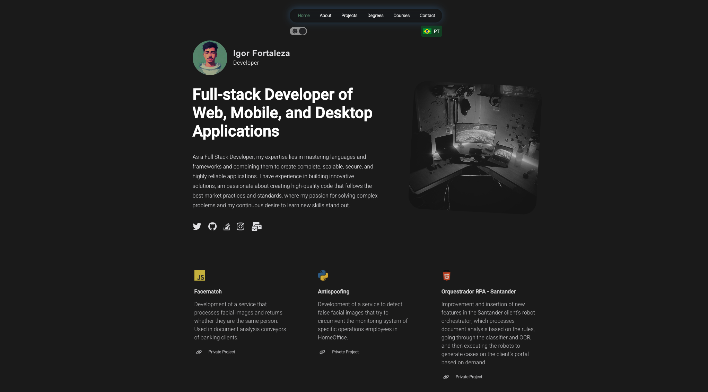

# Reactfolio V1.2 👩🏽‍🚀

Reactfolio is a modern and customizable personal portfolio web template built using the popular React library. It provides an easy way for developers, designers, and creatives to showcase their work, skills, and achievements in a professiona and visually appealing way. With its responsive design and clean code, Reactfolio can be easily tailored to suit individual needs and preferences, making it an ideal choice for anyone looking to create a stunning online portfolio.

    

Live demo here: <a href="" target="_blank">Link/a>
 
Readme here: <a href="https://tharindu.dev/portfolio/reactfolio/" target="_blank">Link2/</a>

-   [Features](#-features)
-   [Getting started](#-getting-started)
-   [Installation and Setup Instructions](#-installation-and-setup-instructions)
-   [Folder structure](#-folder-structure)
-   [Configurations](#-configurations)
-   [Google Analytics](#-google-analytics)
-   [Building the React App](#-building-the-react-app)
-   [FAQ](#-faq)
-   [Contribution](#-contribution)

## 📚 Getting started

Clone down this repository. You will need `NodeJS` and `git` installed globally on your machine.

## 🛠 Installation and Setup Instructions

1. Installation: `npm install`

2. Run the project: `npm start`

Runs the app in the development mode.\
Open [http://localhost:3000](http://localhost:3000) to view it in the browser.
The page will reload if you make edits.

## 📁 Folder structure

-   `/public`: publicly accessible contents (ex: images, media).
-   `/src`: all the components used in this project.
    -   `/src/components/`: each reusable components of each pages.
    -   `/src/data`: configurations of the web app.
    -   `/src/pages`: pages that include in the web app.
